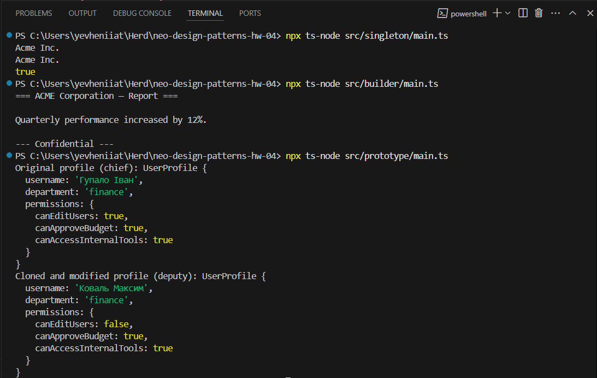

# Породжувальні патерни в TypeScript

У цьому проєкті реалізовано три ключові породжувальні патерни проєктування: **Одинак (Singleton)**, **Будівельник (Builder)** та **Прототип (Prototype)**. Кожен патерн представлений окремою директорією з реалізацією та демонстрацією.

---

## 📂 Структура проєкту
```
/src
/singleton
AppConfigService.ts // Реалізація патерну Одинак
main.ts // Демонстрація використання
/builder
DocumentBuilder.ts // Реалізація патерну Будівельник
main.ts // Формування документа через builder
/prototype
UserProfilePrototype.ts // Інтерфейс для патерну Прототип
UserProfile.ts // Клас з реалізацією clone()
main.ts // Демонстрація клонування профілю
```
---

## ▶ Інструкція запуску

Перед запуском прикладів переконайтесь, що у вас встановлено `ts-node` та `TypeScript`. Якщо ні — виконайте:

```bash
npm install -g ts-node typescript
```

## 🔹 Запуск прикладу Одинак:
```bash
npx ts-node src/singleton/main.ts
```

## 🔹 Запуск прикладу Будівельник:
```bash
npx ts-node src/builder/main.ts
```

## 🔹 Запуск прикладу Прототип:
```bash
npx ts-node src/prototype/main.ts
```

## 📘 Опис патернів
🧩 Singleton (Одинак)
Забезпечує існування лише одного екземпляра класу в системі та надає глобальну точку доступу до нього.

🧩 Builder (Будівельник)
Дає можливість поетапно створювати складні об’єкти, відокремлюючи конструювання від представлення.

🧩 Prototype (Прототип)
Дозволяє створювати нові об’єкти шляхом копіювання вже існуючих, не залежачи від конкретного класу.




# Домашнє завдання до Теми 4

### Опис завдання

У цьому домашньому завданні необхідно опрацювати три окремі приклади застосування породжувальних патернів: Одинак, Будівельник та Прототип.

Кожен приклад подано як реалістичну задачу з практичного TypeScript-контексту. Ваше завдання — проаналізувати початковий код та застосувати відповідний патерн, переписавши реалізацію.

## Структура проєкту

```
src/
├── builder/          # Builder pattern implementation
│   ├── DocumentBuilder.ts
│   └── main.ts
├── prototype/        # Prototype pattern implementation
│   └── main.ts
└── singleton/        # Singleton pattern implementation
    └── main.ts
```

## Запуск

1. Встановити залежності:

```bash
npm install
```

2. Запустити приклад Builder патерну:

```bash
npm run builder
```

3. Запустити приклад Prototype патерну:

```bash
npm run prototype
```

4. Запустити приклад Singleton патерну:

```bash
npm run singleton
```

Для розробки з автоматичною перезбіркою:

```bash
npm run dev
```
